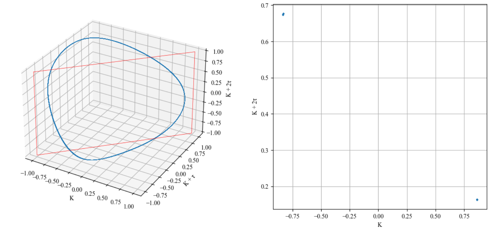
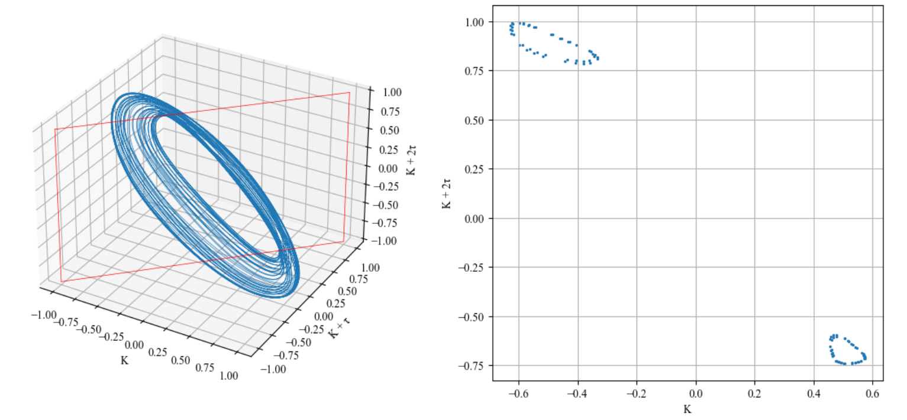

# 3次元アトラクタ＆ポアンカレマップ描写

このリポジトリはカオス解析の１手法として、3 列データ（x, y, z）から  
**3Dアトラクタの描画** と **ポアンカレ断面の抽出・可視化** を行うPythonスクリプトです。

研究の中で自分用に作ったコードを、勉強の記録として公開しています。  
プログラミングはまだまだ初心者ですが、このコードを公開することで、研究室のメンバーや今後の学生が
参考にできるようにしたいと思っています。


## 作成者からのメッセージ
-最適化されたコードではありません

-同じ解析をもっと綺麗に、速く書く方法があるかもしれません

-これから学びながら少しずつ改善していく予定です

-ミスのご指摘、アドバイス大歓迎です！

##  このスクリプトでできること

- 3 列データ（x, y, z）を読み込む  
- ポアンカレ断面  
  \[
  y = a x + b
  \]
  を指定して、断面を通過した点を補間で取得  
- 3Dアトラクタを描画  
- ポアンカレマップ（2D 散布図）を作成  
- 軸ラベル（x, y, z）をユーザー入力で変更可能  
- 断面の係数 a, b も入力で自由に設定可能  


## 必要なライブラリ

numpy
matplotlib


インストール：

```bush
pip install numpy matplotlib
```


## 使い方
 
1. 実行後、画面の指示に従って入力します。
   - 入力データファイルのパス（下記参照ください）
   - x, y, z の軸ラベル
   - ポアンカレ断面の係数 a, b

3. 3D アトラクタと 2D ポアンカレマップが表示されます。


##  入力データの形式

テキストファイル（.txt）で、  
**空白区切り 3 列の数値データ**を入れてください：

```bush
0.123 0.456 0.789
0.124 0.458 0.790
0.125 0.460 0.791
```

## 📊出力例






